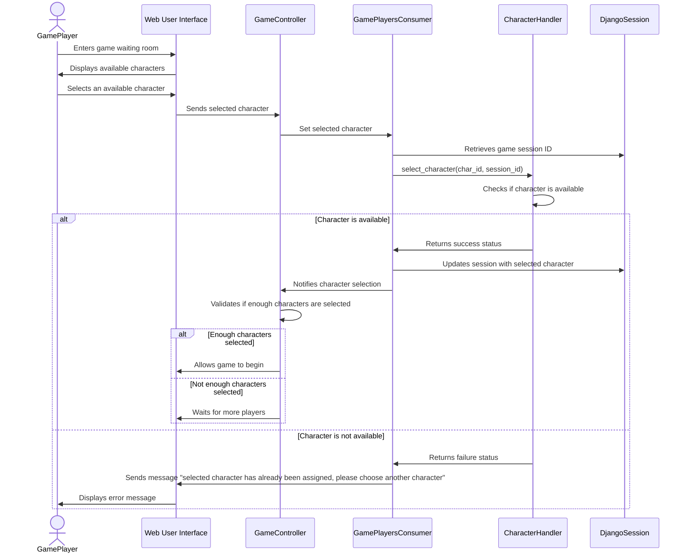
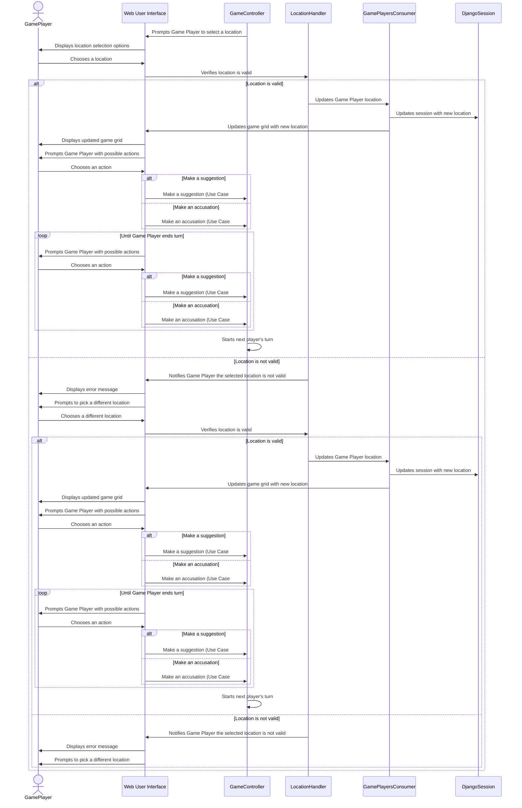
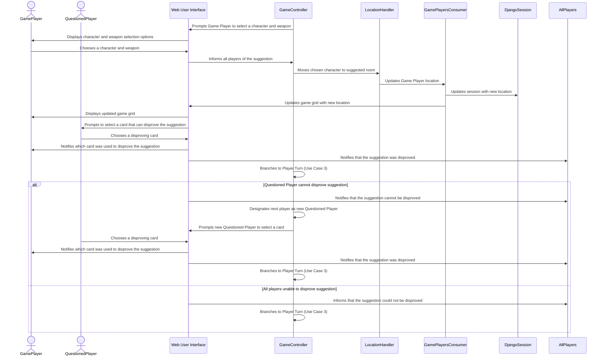
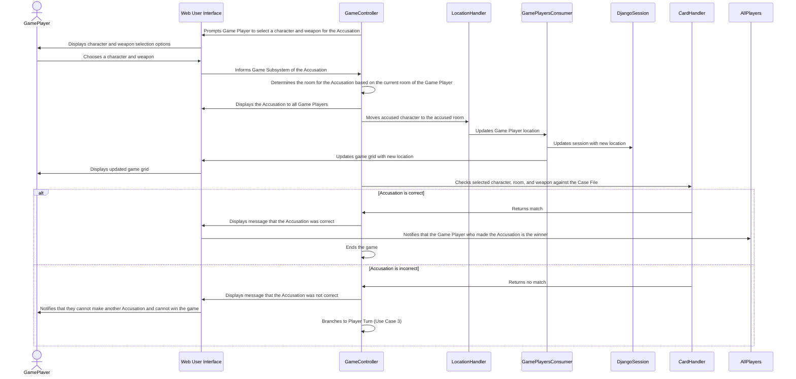
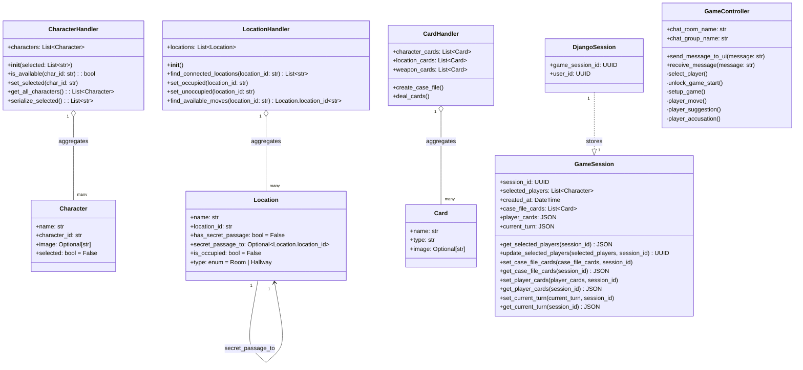

## Begin Game Sequence Diagram

```mermaid
sequenceDiagram
    actor GamePlayer
    participant WebUI as Web User Interface
    participant GameController
    participant GamePlayersConsumer
    participant CharacterHandler
    participant DjangoSession

    GamePlayer ->> WebUI: Enters game waiting room
    WebUI ->> GamePlayer: Displays available characters
    GamePlayer ->> WebUI: Selects an available character
    WebUI ->> GameController: Sends selected character
    GameController ->> GamePlayersConsumer: Set selected character
    GamePlayersConsumer ->> DjangoSession: Retrieves game session ID
    GamePlayersConsumer ->> CharacterHandler: select_character(char_id, session_id)
    CharacterHandler ->> CharacterHandler: Checks if character is available
    alt Character is available
        CharacterHandler ->> GamePlayersConsumer: Returns success status
        GamePlayersConsumer ->> DjangoSession: Updates session with selected character
        GamePlayersConsumer ->> GameController: Notifies character selection
        GameController ->> GameController: Validates if enough characters are selected
        alt Enough characters selected
            GameController ->> WebUI: Allows game to begin
        else Not enough characters selected
            GameController ->> WebUI: Waits for more players
        end
    else Character is not available
        CharacterHandler ->> GamePlayersConsumer: Returns failure status
        GamePlayersConsumer ->> WebUI: Sends message "selected character has already been assigned, please choose another character"
        WebUI ->> GamePlayer: Displays error message
    end
```

## Player Move Sequence Diagram

```mermaid

sequenceDiagram
    actor GamePlayer
    participant WebUI as Web User Interface
    participant GameController
    participant LocationHandler
    participant GamePlayersConsumer
    participant DjangoSession

    GameController ->> WebUI: Prompts Game Player to select a location
    WebUI ->> GamePlayer: Displays location selection options
    GamePlayer ->> WebUI: Chooses a location
    WebUI ->> LocationHandler: Verifies location is valid
    alt Location is valid
        LocationHandler ->> GamePlayersConsumer: Updates Game Player location
        GamePlayersConsumer ->> DjangoSession: Updates session with new location
        GamePlayersConsumer ->> WebUI: Updates game grid with new location
        WebUI ->> GamePlayer: Displays updated game grid
        WebUI ->> GamePlayer: Prompts Game Player with possible actions
        GamePlayer ->> WebUI: Chooses an action
        alt Make a suggestion
            WebUI ->> GameController: Make a suggestion (Use Case #5)
        else Make an accusation
            WebUI ->> GameController: Make an accusation (Use Case #4)
        end
        loop Until Game Player ends turn
            WebUI ->> GamePlayer: Prompts Game Player with possible actions
            GamePlayer ->> WebUI: Chooses an action
            alt Make a suggestion
                WebUI ->> GameController: Make a suggestion (Use Case #5)
            else Make an accusation
                WebUI ->> GameController: Make an accusation (Use Case #4)
            end
        end
        GameController ->> GameController: Starts next player's turn
    else Location is not valid
        LocationHandler ->> WebUI: Notifies Game Player the selected location is not valid
        WebUI ->> GamePlayer: Displays error message
        WebUI ->> GamePlayer: Prompts to pick a different location
        GamePlayer ->> WebUI: Chooses a different location
        WebUI ->> LocationHandler: Verifies location is valid
        alt Location is valid
            LocationHandler ->> GamePlayersConsumer: Updates Game Player location
            GamePlayersConsumer ->> DjangoSession: Updates session with new location
            GamePlayersConsumer ->> WebUI: Updates game grid with new location
            WebUI ->> GamePlayer: Displays updated game grid
            WebUI ->> GamePlayer: Prompts Game Player with possible actions
            GamePlayer ->> WebUI: Chooses an action
            alt Make a suggestion
                WebUI ->> GameController: Make a suggestion (Use Case #5)
            else Make an accusation
                WebUI ->> GameController: Make an accusation (Use Case #4)
            end
            loop Until Game Player ends turn
                WebUI ->> GamePlayer: Prompts Game Player with possible actions
                GamePlayer ->> WebUI: Chooses an action
                alt Make a suggestion
                    WebUI ->> GameController: Make a suggestion (Use Case #5)
                else Make an accusation
                    WebUI ->> GameController: Make an accusation (Use Case #4)
                end
            end
            GameController ->> GameController: Starts next player's turn
        else Location is not valid
            LocationHandler ->> WebUI: Notifies Game Player the selected location is not valid
            WebUI ->> GamePlayer: Displays error message
            WebUI ->> GamePlayer: Prompts to pick a different location
        end
    end


```
## Player Suggestion Sequence Diagram

```mermaid
sequenceDiagram
    actor GamePlayer
    actor QuestionedPlayer
    participant WebUI as Web User Interface
    participant GameController
    participant LocationHandler
    participant GamePlayersConsumer
    participant DjangoSession

    GameController ->> WebUI: Prompts Game Player to select a character and weapon
    WebUI ->> GamePlayer: Displays character and weapon selection options
    GamePlayer ->> WebUI: Chooses a character and weapon
    WebUI ->> GameController: Informs all players of the suggestion
    GameController ->> LocationHandler: Moves chosen character to suggested room
    LocationHandler ->> GamePlayersConsumer: Updates Game Player location
    GamePlayersConsumer ->> DjangoSession: Updates session with new location
    GamePlayersConsumer ->> WebUI: Updates game grid with new location
    WebUI ->> GamePlayer: Displays updated game grid
    WebUI ->> QuestionedPlayer: Prompts to select a card that can disprove the suggestion
    QuestionedPlayer ->> WebUI: Chooses a disproving card
    WebUI ->> GamePlayer: Notifies which card was used to disprove the suggestion
    WebUI ->> AllPlayers: Notifies that the suggestion was disproved
    GameController ->> GameController: Branches to Player Turn (Use Case 3)

    alt Questioned Player cannot disprove suggestion
        WebUI ->> AllPlayers: Notifies that the suggestion cannot be disproved
        GameController ->> GameController: Designates next player as new Questioned Player
        GameController ->> WebUI: Prompts new Questioned Player to select a card
        QuestionedPlayer ->> WebUI: Chooses a disproving card
        WebUI ->> GamePlayer: Notifies which card was used to disprove the suggestion
        WebUI ->> AllPlayers: Notifies that the suggestion was disproved
        GameController ->> GameController: Branches to Player Turn (Use Case 3)
    else All players unable to disprove suggestion
        WebUI ->> AllPlayers: Informs that the suggestion could not be disproved
        GameController ->> GameController: Branches to Player Turn (Use Case 3)
    end

```

## Player Accusation Sequence Diagram

```mermaid
sequenceDiagram
    actor GamePlayer
    participant WebUI as Web User Interface
    participant GameController
    participant LocationHandler
    participant GamePlayersConsumer
    participant DjangoSession
    participant CardHandler
    GameController ->> WebUI: Prompts Game Player to select a character and weapon for the Accusation
    WebUI ->> GamePlayer: Displays character and weapon selection options
    GamePlayer ->> WebUI: Chooses a character and weapon
    WebUI ->> GameController: Informs Game Subsystem of the Accusation
    GameController ->> GameController: Determines the room for the Accusation based on the current room of the Game Player
    GameController ->> WebUI: Displays the Accusation to all Game Players
    GameController ->> LocationHandler: Moves accused character to the accused room
    LocationHandler ->> GamePlayersConsumer: Updates Game Player location
    GamePlayersConsumer ->> DjangoSession: Updates session with new location
    GamePlayersConsumer ->> WebUI: Updates game grid with new location
    WebUI ->> GamePlayer: Displays updated game grid
    GameController ->> CardHandler: Checks selected character, room, and weapon against the Case File
    alt Accusation is correct
        CardHandler ->> GameController: Returns match
        GameController ->> WebUI: Displays message that the Accusation was correct
        WebUI ->> AllPlayers: Notifies that the Game Player who made the Accusation is the winner
        GameController ->> GameController: Ends the game
    else Accusation is incorrect
        CardHandler ->> GameController: Returns no match
        GameController ->> WebUI: Displays message that the Accusation was not correct
        WebUI ->> GamePlayer: Notifies that they cannot make another Accusation and cannot win the game
        GameController ->> GameController: Branches to Player Turn (Use Case 3)
    end
```

## Class Diagram

```mermaid
classDiagram
    class Character {
        +name: str
        +character_id: str
        +image: Optional[str]
        +selected: bool = False
    }

    class CharacterHandler {
        +characters: List~Character~
        +__init__(selected: List~str~)
        +is_available(char_id: str): bool
        +set_selected(char_id: str)
        +get_all_characters(): List~Character~
        +serialize_selected(): List~str~
    }

    class Location {
        +name: str
        +location_id: str
        +has_secret_passage: bool = False
        +secret_passage_to: Optional~Location.location_id~
        +is_occupied: bool = False
        +type: enum = Room | Hallway
    }

    class LocationHandler {
        +locations: List~Location~
        +__init__()
        +find_connected_locations(location_id: str) List~str~
        +set_occupied(location_id: str)
        +set_unoccupied(location_id: str)
        +find_available_moves(location_id: str) Location.location_id~str~
    }

    class Card {
        +name: str
        +type: str
        +image: Optional[str]
    }

    class CardHandler {
        +character_cards: List~Card~
        +location_cards: List~Card~
        +weapon_cards: List~Card~
        +create_case_file()
        +deal_cards()
    }

    class GameSession {
        +session_id: UUID
        +selected_players: List~Character~
        +created_at: DateTime
        +case_file_cards: List~Card~
        +player_cards: JSON
        +current_turn: JSON
        +get_selected_players(session_id) JSON
        +update_selected_players(selected_players, session_id) UUID
        +set_case_file_cards(case_file_cards, session_id)
        +get_case_file_cards(session_id) JSON
        +set_player_cards(player_cards, session_id)
        +get_player_cards(session_id) JSON
        +set_current_turn(current_turn, session_id)
        +get_current_turn(session_id) JSON
    }

    class DjangoSession {
        +game_session_id: UUID
        +user_id: UUID
    }

    class GameController {
        +chat_room_name: str
        +chat_group_name: str
        +send_message_to_ui(message: str)
        +receive_message(message: str)
        -select_player()
        -unlock_game_start()
        -setup_game()
        -player_move()
        -player_suggestion()
        -player_accusation()
    }

    %%note for WebSocket "Django Channels Websocket object, keeps connection alive with web interface"


    CharacterHandler "1" o-- "many" Character : aggregates
    LocationHandler "1" o-- "many" Location : aggregates
    CardHandler "1" o-- "many" Card : aggregates
    Location "1" --> "1" Location : secret_passage_to
    DjangoSession "1" ..|> "1" GameSession : stores
    %% GameController <|-- WebSocket: inherits
```