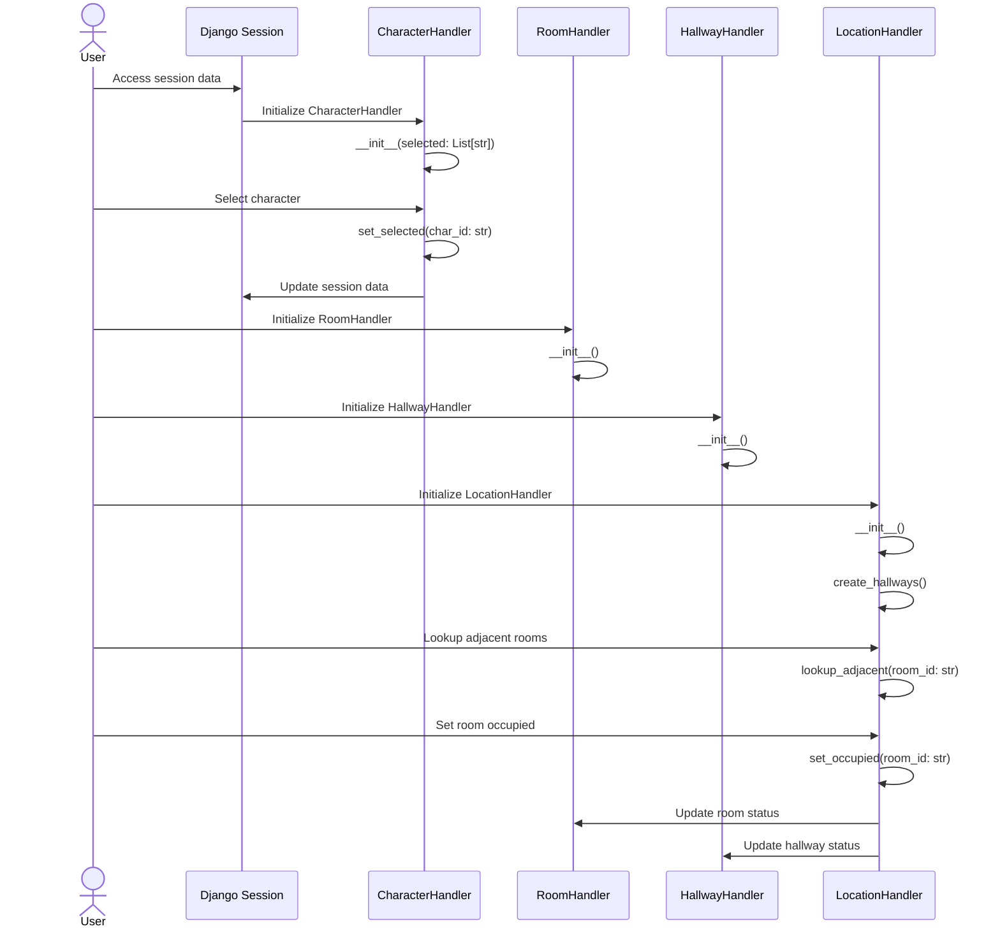
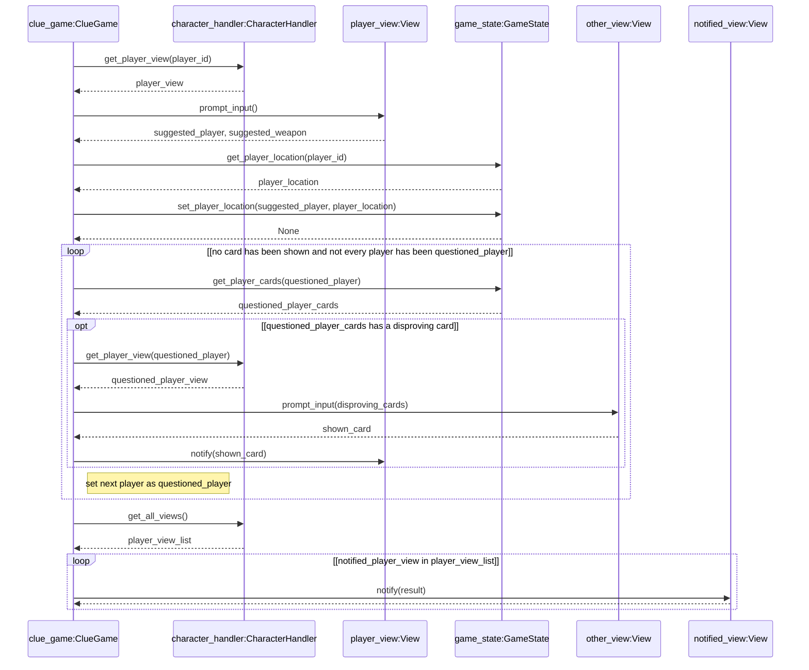
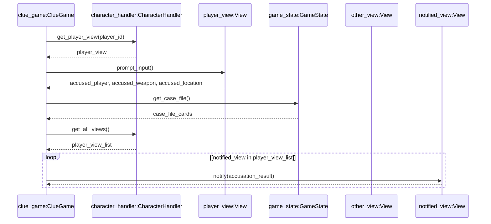
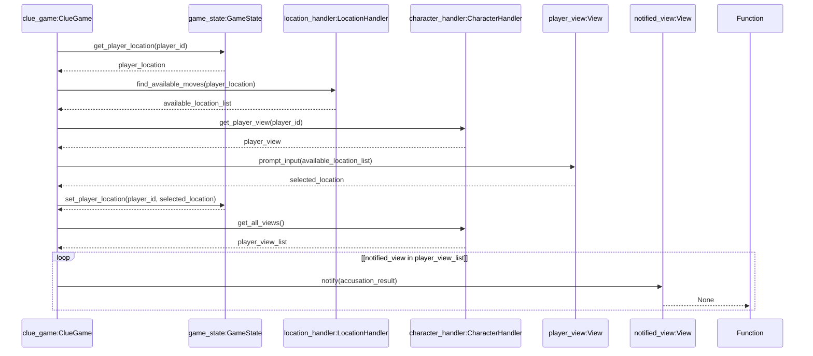

## Sequence Diagram

```mermaid
sequenceDiagram
    actor User
    participant Session as Django Session
    participant CH as CharacterHandler
    participant RH as RoomHandler
    participant HH as HallwayHandler
    participant LH as LocationHandler

    User ->> Session: Access session data
    Session ->> CH: Initialize CharacterHandler
    CH ->> CH: __init__(selected: List[str])
    User ->> CH: Select character
    CH ->> CH: set_selected(char_id: str)
    CH ->> Session: Update session data

    User ->> RH: Initialize RoomHandler
    RH ->> RH: __init__()

    User ->> HH: Initialize HallwayHandler
    HH ->> HH: __init__()

    User ->> LH: Initialize LocationHandler
    LH ->> LH: __init__()
    LH ->> LH: create_hallways()

    User ->> LH: Lookup adjacent rooms
    LH ->> LH: lookup_adjacent(room_id: str)

    User ->> LH: Set room occupied
    LH ->> LH: set_occupied(room_id: str)
    LH ->> RH: Update room status
    LH ->> HH: Update hallway status

```

## Class Diagram

```mermaid
classDiagram
    class Character {
        +name: str
        +id: str
        +image: Optional[str]
        +selected: bool = False
    }

    class CharacterHandler {
        +characters: List~Character~
        +__init__(selected: List~str~)
        +is_available(char_id: str): bool
        +set_selected(char_id: str)
        +get_all_characters(): List~Character~
        +serialize_selected(): List~str~
    }

    class Room {
        +name: str
        +id: str
        +has_secret_passage: bool = False
        +secret_passage_to: Optional[str]
        +is_occupied: bool = False
    }

    class RoomHandler {
        +rooms: List~Room~
        +__init__()
    }

    class Hallway {
        +id: str
        +name: str
        +connected_rooms: List~str~
        +is_occupied: bool = False
        +set_occupied(status: bool)
    }

    class HallwayHandler {
        +hallways: List~Hallway~
        +__init__()
        +find_hallway(room_id_1: str, room_id_2: str): Hallway
        +set_hallway_occupied(hallway_id: str, status: bool)
    }

    class LocationHandler {
        +rooms: List~List~Room~~
        +hallways: List~Hallway~
        +__init__()
        +lookup_adjacent(room_id: str): List~str~
        +create_hallways()
        +set_occupied(room_id: str)
    }

    CharacterHandler --> Character
    RoomHandler --> Room
    HallwayHandler --> Hallway
    LocationHandler --> Room
    LocationHandler --> Hallway

```

## Player Suggestion Sequence Diagram

```mermaid
sequenceDiagram
    participant Game as clue_game:ClueGame
    participant CH as character_handler:CharacterHandler
    participant View as player_view:View
    participant GS as game_state:GameState
    participant OtherView as other_view:View
    participant NotifiedView as notified_view:View
    Game ->> CH: get_player_view(player_id)
    CH -->> Game: player_view
    Game ->> View: prompt_input()
    View -->> Game: suggested_player, suggested_weapon
    Game ->> GS: get_player_location(player_id)
    GS -->> Game: player_location
    Game ->> GS: set_player_location(suggested_player, player_location)
    GS -->> Game: None
    loop [no card has been shown and not every player has been questioned_player]
        Game ->> GS: get_player_cards(questioned_player)
        GS -->> Game: questioned_player_cards
        opt [questioned_player_cards has a disproving card]
            Game ->> CH: get_player_view(questioned_player)
            CH -->> Game: questioned_player_view
            Game ->> OtherView: prompt_input(disproving_cards)
            OtherView -->> Game: shown_card
            Game ->> View: notify(shown_card)
        end
        Note right of Game: set next player as questioned_player
    end
    Game ->> CH: get_all_views()
    CH -->> Game: player_view_list
    loop [notified_player_view in player_view_list]
        Game ->> NotifiedView: notify(result)
        NotifiedView -->> Game: 
    end
    
    
```
## Player Accusation Sequence Diagram

```mermaid
sequenceDiagram
    participant Game as clue_game:ClueGame
    participant CH as character_handler:CharacterHandler
    participant View as player_view:View
    participant GS as game_state:GameState
    participant OtherView as other_view:View
    participant NotifiedView as notified_view:View
    
    Game ->> CH: get_player_view(player_id)
    CH -->> Game: player_view
    Game ->> View: prompt_input()
    View -->> Game: accused_player, accused_weapon, accused_location
    Game ->> GS: get_case_file()
    GS -->> Game: case_file_cards
    Game ->> CH: get_all_views()
    CH -->> Game: player_view_list
    loop [notified_view in player_view_list]
        Game ->> NotifiedView: notify(accusation_result)
        NotifiedView -->> Game: 
    end
```

## Player Movement Sequence Diagram

```mermaid
sequenceDiagram
    participant Game as clue_game:ClueGame
    participant GS as game_state:GameState
    participant LH as location_handler:LocationHandler
    participant CH as character_handler:CharacterHandler
    participant View as player_view:View
    participant NotifiedView as notified_view:View
    
    Game ->> GS: get_player_location(player_id)
    GS -->> Game: player_location
    Game ->> LH: find_available_moves(player_location)
    LH -->> Game: available_location_list
    Game ->> CH: get_player_view(player_id)
    CH -->> Game: player_view
    Game ->> View: prompt_input(available_location_list)
    View -->> Game: selected_location
    Game ->> GS: set_player_location(player_id, selected_location)
    GS -->> Game: 
    
    Game ->> CH: get_all_views()
    CH -->> Game: player_view_list
    loop [notified_view in player_view_list]
        Game ->> NotifiedView: notify(accusation_result)
        NotifiedView -->> Function: None
    end
```